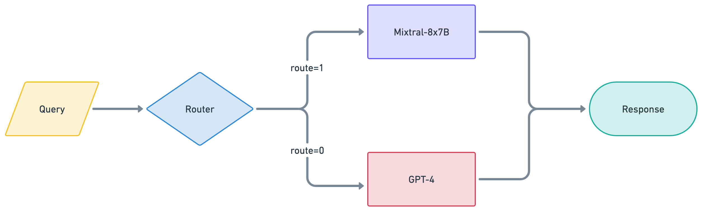
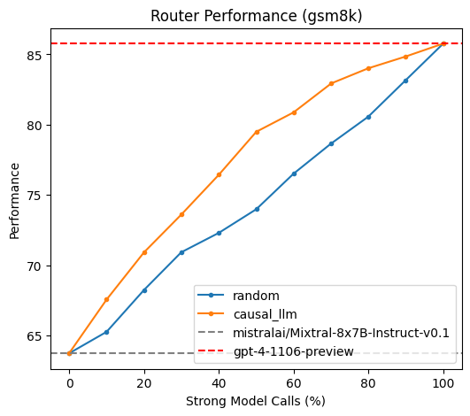

# Introduction

When building Large Language Model (LLM) applications, we strive to balance between achieving the highest response quality while adhering to a limited cost budget. Closed models like GPT-4 are renowned for their superior quality, but they can become prohibitively expensive, especially when handling a large volume of queries. On the other hand, Open Source Software (OSS) models are more cost-effective but may not deliver the same quality, particularly for complex or domain-specific queries.

A "smart router" addresses this challenge by processing user queries and deciding whether to route them to a closed LLM or an OSS LLM, depending on the query's complexity or domain. Here’s a schematic representation of a smart router:

<div style="text-align: center;">
    
</div>

Given a set of user queries, a smart router enables generating high-quality LLM responses while minimizing the overall cost.

# Approach

In this tutorial, we'll demonstrate how to train a smart router on the Anyscale platform. We make the following design choices:

1. **Model Choices**: We’ll use GPT-4 as an example of a closed LLM and Mixtral-8x7B as the OSS LLM, so our smart router will route between these two models.
2. **Response Quality Rating**: We'll quantify the quality of an LLM response on a scale of 1 to 5 stars, with higher scores indicating better quality. For simplicity, we'll assume that GPT-4 always achieves a 5-star rating, so it serves as a reference for Mixtral-8x7B.
3. **Smart Router Model**: We'll finetune a Llama3-8B model as our smart router and leverage Anyscale's powerful API. Our research (see our [arXiv paper](put link to arxiv paper)) shows that this model offers superior routing performance compared to smaller architectures.

More concretely, the objective of a smart router is to direct simple queries to Mixtral-8x7B, thereby maintaining high overall response quality (e.g., an average score of 4.8/5) while significantly reducing costs (e.g., by 50%).


# Table of Contents

1. [**Prepare Labeled Data**](#generate-labeled-data): We describe how to generate synthetic labeled data to train the smart router model.

2. [**Finetune a Router Model**](#finetune-router-model): We show how to train a smart router by finetuning an LLM classifier using Anyscale's finetuning API.

3. [**Offline Evaluation**](#offline-eval): We run offline evaluation of the model on standard benchmarks.

**Time to complete**: 90 minutes including training on 8xA10 GPUs


### Setup


```python
import os

# Install required packages
!pip install -r requirements.txt

# Store your ANYSCALE_API_KEY and OPENAI_API_KEY in /home/ray/default/.env
from dotenv import load_dotenv
load_dotenv("/home/ray/default/.env")

```


# Step 1: Prepare Labeled Data <a id="generate-labeled-data"></a>

Our smart router essentially functions as a binary classifier, deciding whether to route a query to GPT-4 or Mixtral-8x7B based on the query text. Initially, we considered labeled data in the format `(query, routing_label)`, where `routing_label` is 1 if the query should be routed to Mixtral-8x7B and 0 if it should be routed to GPT-4.

However, our early experiments revealed that *binary labels do not provide sufficient signal for training a robust router model*. Therefore, we adopted a different labeling approach using a *1-5 scoring system*, which reflects how well Mixtral-8x7B can effectively respond to the user's query. More specifically:

- **4-5**: Mixtral-8x7B produces a very strong answer, showing deep understanding, creativity, detailed insight, and high relevance.
- **3**: Mixtral-8x7B provides an adequate answer with moderate detail, relevance, and factual accuracy.
- **1-2**: Mixtral-8x7B struggles to produce a strong answer due to the question's difficulty, vagueness, or the model's limitations.

We use labeled samples in the format `(query, score_label)`. The `routing_label` can be derived from the `score_label` by setting a score threshold for quality, i.e. `routing_label = 1 if score_label >= 4 else 0`.

In the following, we will explain how we prepare our labeled dataset in detail.


## 1.1: Query Dataset

We want our smart router to be effective in open-ended chat domains. So, our first step is to collect a set of generic queries from the [Nectar dataset](https://huggingface.co/datasets/berkeley-nest/Nectar). We chose the Nectar dataset for two reasons: it combines queries from many different domains, including open-ended chat, and it has responses from many models, including over 191K responses from GPT-4.


```python
from src.utils import load_and_display_nectar

nectar_df = load_and_display_nectar()
```


<div>
<style scoped>
    .dataframe tbody tr th:only-of-type {
        vertical-align: middle;
    }

    .dataframe tbody tr th {
        vertical-align: top;
    }

    .dataframe thead th {
        text-align: right;
    }
</style>
<table border="1" class="dataframe">
  <thead>
    <tr style="text-align: right;">
      <th></th>
      <th>prompt</th>
      <th>answers</th>
      <th>turns</th>
      <th>source</th>
      <th>good_natured</th>
    </tr>
  </thead>
  <tbody>
    <tr>
        <th>0</th>
        <td>\n\nHuman: 0.002 = 1000 \n1 = x?\n\nAssistant:</td>
        <td>
            [<br>{'answer': 'To find the value of x, we can set up a proportion using the given information:
0.002/1000 = 1/x
  ...  x = 500,000', 'model': 'gpt-3.5-turbo', 'rank': 3.0},<br><br>
{'answer': 'If 0.002 equals 1000, then 1 would equal 500,000.', 'model': 'gpt-4', 'rank': 4.0},<br><br>
{'answer': 'I apologize, but the equation you provided is not correct.
...', 'model': 'llama-2-7b-chat', 'rank': 5.0},<br><br>
{'answer': '0.001 = x', 'model': 'gpt-3.5-turbo-instruct', 'rank': 6.0},<br><br>
{'answer': 'It seems like you are asking for the value of x in the equation x = 1/0.002. 
To solve this equation, you can divide both sides by 0.002 to get:
x = 1/0.002
x = 500
Therefore, x = 500.', 'model': 'mistral-7b-instruct-v0.1', 'rank': 7.0}<br>]</td>
        <td>1</td>
        <td>[sharegpt]</td>
        <td>True</td>
    </tr>
  </tbody>
</table>
</div>


    Number of queries with GPT-4 responses: 191487


## 1.2 Data Preprocessing

We will use a subset of the Nectar data that includes responses from GPT-4, as these will be used to generate scores (as shown below). We will process this data by focusing on single-turn conversations, filtering for good-natured interactions, and cleaning up the prompts and responses to maintain high quality. Additionally, we will sample a small subset from the dataset for the purpose of this tutorial; however, you can skip sampling to work with the full dataset.


```python
from src.utils import preprocess_nectar

nectar_gpt4_df = preprocess_nectar(
    nectar_df, model="gpt-4", response_column="gpt4_response"
)

# Sample a small subset from the dataset for the purpose of this tutorial
N_SUBSET = 30
dataset_df = nectar_gpt4_df.sample(N_SUBSET, random_state=42)
```

### Dataset overview with GPT-4 responses


```python
display(dataset_df.head())
```


<div>
<style scoped>
    .dataframe tbody tr th:only-of-type {
        vertical-align: middle;
    }

    .dataframe tbody tr th {
        vertical-align: top;
    }

    .dataframe thead th {
        text-align: right;
    }
</style>
<table border="1" class="dataframe">
  <thead>
    <tr style="text-align: right;">
      <th></th>
      <th>prompt</th>
      <th>source</th>
      <th>gpt4_response</th>
    </tr>
  </thead>
  <tbody>
    <tr>
      <th>6062</th>
      <td>Based on the features mentioned, which hotel d...</td>
      <td>[evol_instruct]</td>
      <td>Based on the features mentioned, Hotel A seems...</td>
    </tr>
    <tr>
      <th>113830</th>
      <td>Provide step-by-step instructions on how to cr...</td>
      <td>[ultrachat]</td>
      <td>Sure, here's a simple step-by-step guide on ho...</td>
    </tr>
    <tr>
      <th>138869</th>
      <td>What are the 10 largest cities in the US by po...</td>
      <td>[lmsys-chat-1m]</td>
      <td>As of the most recent data available, the 10 l...</td>
    </tr>
    <tr>
      <th>169249</th>
      <td>Write a comparison essay of at least 500 words...</td>
      <td>[ultrachat]</td>
      <td>Title: A Comparative Analysis of Driving a Car...</td>
    </tr>
    <tr>
      <th>116934</th>
      <td>Q: You are provided with an "Event", "Intent" ...</td>
      <td>[flan_v2_niv2]</td>
      <td>PersonX might feel satisfied or content using ...</td>
    </tr>
  </tbody>
</table>
</div>


## 1.3 Data Labeling

We don't have human labels for scores, so we will use the [LLM-as-a-Judge approach](https://arxiv.org/abs/2306.05685). GPT-4 will act as an evaluator, reviewing the query and Mixtral's response to provide a score from 1-5. As shown in the paper, the most robust way to get labels is by providing a reference answer for comparison. Here, GPT-4's own response serves as the reference, and Mixtral's response is evaluated against it.

There are two main steps in this process:
1. **Generate Mixtral-8x7B responses for all queries**: We will use an online batch-inference method utilizing Ray and Anyscale endpoints.
2. **Generate LLM-as-a-Judge labels**: We will ask GPT-4 to evaluate the Mixtral responses against its own reference answers and provide a score from 1 to 5.

### Generate Mixtral-8x7B Responses


```python
import yaml
from src.online_inference import generate_mixtral_responses

dataset_df = generate_mixtral_responses(
    dataset_df, os.getenv("ANYSCALE_API_KEY"), response_column="mixtral_response"
)
```
    Starting batch inference on 30 queries...

    # queries un-processed: 29, in-progress: 1, ready: 0
    # queries un-processed: 28, in-progress: 2, ready: 0
    # queries un-processed: 27, in-progress: 3, ready: 0
    # queries un-processed: 26, in-progress: 4, ready: 0
    # queries un-processed: 25, in-progress: 5, ready: 0
    # queries un-processed: 24, in-progress: 6, ready: 0
    # queries un-processed: 23, in-progress: 7, ready: 0
    # queries un-processed: 22, in-progress: 8, ready: 0
    # queries un-processed: 21, in-progress: 9, ready: 0
    # queries un-processed: 20, in-progress: 10, ready: 0
    # queries un-processed: 19, in-progress: 11, ready: 0
    # queries un-processed: 18, in-progress: 12, ready: 0
    # queries un-processed: 17, in-progress: 13, ready: 0
    # queries un-processed: 16, in-progress: 14, ready: 0
    # queries un-processed: 15, in-progress: 15, ready: 0
    # queries un-processed: 14, in-progress: 16, ready: 0
    # queries un-processed: 13, in-progress: 17, ready: 0
    # queries un-processed: 12, in-progress: 18, ready: 0
    # queries un-processed: 11, in-progress: 18, ready: 1
    # queries un-processed: 10, in-progress: 18, ready: 1
    # queries un-processed: 9, in-progress: 18, ready: 1
    # queries un-processed: 8, in-progress: 18, ready: 1
    # queries un-processed: 7, in-progress: 18, ready: 1
    # queries un-processed: 6, in-progress: 19, ready: 0
    ...
    Done in 21.47sec.


### Dataset overview with Mixtral responses


```python
display(dataset_df.head())
```


<div>
<style scoped>
    .dataframe tbody tr th:only-of-type {
        vertical-align: middle;
    }

    .dataframe tbody tr th {
        vertical-align: top;
    }

    .dataframe thead th {
        text-align: right;
    }
</style>
<table border="1" class="dataframe">
  <thead>
    <tr style="text-align: right;">
      <th></th>
      <th>prompt</th>
      <th>source</th>
      <th>gpt4_response</th>
      <th>mixtral_response</th>
    </tr>
  </thead>
  <tbody>
    <tr>
      <th>6062</th>
      <td>Based on the features mentioned, which hotel d...</td>
      <td>[evol_instruct]</td>
      <td>Based on the features mentioned, Hotel A seems...</td>
      <td>Based on the information provided, I would su...</td>
    </tr>
    <tr>
      <th>113830</th>
      <td>Provide step-by-step instructions on how to cr...</td>
      <td>[ultrachat]</td>
      <td>Sure, here's a simple step-by-step guide on ho...</td>
      <td>Sure, I'd be happy to help you make a homemad...</td>
    </tr>
    <tr>
      <th>138869</th>
      <td>What are the 10 largest cities in the US by po...</td>
      <td>[lmsys-chat-1m]</td>
      <td>As of the most recent data available, the 10 l...</td>
      <td>Here are the 10 largest cities in the U.S. by...</td>
    </tr>
    <tr>
      <th>169249</th>
      <td>Write a comparison essay of at least 500 words...</td>
      <td>[ultrachat]</td>
      <td>Title: A Comparative Analysis of Driving a Car...</td>
      <td>Title: The Great Debate: Driving a Car vs. Ri...</td>
    </tr>
    <tr>
      <th>116934</th>
      <td>Q: You are provided with an "Event", "Intent" ...</td>
      <td>[flan_v2_niv2]</td>
      <td>PersonX might feel satisfied or content using ...</td>
      <td>PersonX likely feels comfortable and focused,...</td>
    </tr>
  </tbody>
</table>
</div>


### Generate GPT-4-as-a-judge scores 

Let's first take a look at an example query we will send to GPT-4 for judgement


```python
from src.utils import inspect_llm_judge_queries

inspect_llm_judge_queries(dataset_df)
```

    [Instruction]
    Evaluate the AI assistant's proficiency in answering the user question displayed below. Your evaluation should consider factors such as the helpfulness, relevance, adherence to real-world facts, depth, creativity, and level of detail of the response. You will be given a reference answer which is considered of high quality. Your assessment will have two lines: First line has a rating on a scale of 1 to 5 with a higher rating representing higher response quality. Follow strictly this format: "[[rating]]", for example: "[[3]]". Second line contains a short explanation of your rating.
    
    [Question]
    Q: You are provided with an "Event", "Intent" related to PersonX. Guess a reaction/reaction of PersonX about the given event and their intention.
    Event:PersonX uses ___ in class. Intent: 1) to use his prefered writing implement
    A:
    
    [Reference Answer]
    PersonX might feel satisfied or content using their preferred writing implement in class, as it aligns with their intention to utilize a comfortable and desired tool for writing. 
    Confidence: 85%
    
    [Assistant Answer]
     PersonX likely feels comfortable and focused, as they are using their preferred writing implement in class. This may help them engage more effectively with the material being taught.
    
    Guidelines for Rating:
     - High Rating (4-5): Reserved for responses that are very close to the quality of the reference or even better.
     - Medium Rating (3): Reserved for responses that have moderate quality compared to the reference.
     - Low Rating (1-2): Allocated to response that are much lower quality compared to the reference or completely wrong.
    
    Assessment:
    


Now, we apply a similar online batch-inference method to generate our labels.


```python
import yaml
from src.online_inference import generate_llm_judge_labels

dataset_df = generate_llm_judge_labels(dataset_df, os.getenv('OPENAI_API_KEY'))
```

    Starting batch inference on 30 queries...
    # queries un-processed: 29, in-progress: 1, ready: 0
    # queries un-processed: 28, in-progress: 2, ready: 0
    # queries un-processed: 27, in-progress: 3, ready: 0
    # queries un-processed: 26, in-progress: 4, ready: 0
    # queries un-processed: 25, in-progress: 5, ready: 0
    # queries un-processed: 24, in-progress: 6, ready: 0
    # queries un-processed: 23, in-progress: 7, ready: 0
    # queries un-processed: 22, in-progress: 7, ready: 1
    # queries un-processed: 21, in-progress: 7, ready: 1
    # queries un-processed: 20, in-progress: 8, ready: 0
    # queries un-processed: 19, in-progress: 8, ready: 1
    # queries un-processed: 18, in-progress: 9, ready: 0
    # queries un-processed: 17, in-progress: 10, ready: 0
    # queries un-processed: 17, in-progress: 9, ready: 1
    # queries un-processed: 16, in-progress: 9, ready: 1
    # queries un-processed: 15, in-progress: 9, ready: 1
    ...
    Done in 16.43sec.


### Dataset overview with score labels


```python
display(dataset_df.head())
```


<div>
<style scoped>
    .dataframe tbody tr th:only-of-type {
        vertical-align: middle;
    }

    .dataframe tbody tr th {
        vertical-align: top;
    }

    .dataframe thead th {
        text-align: right;
    }
</style>
<table border="1" class="dataframe">
  <thead>
    <tr style="text-align: right;">
      <th></th>
      <th>prompt</th>
      <th>source</th>
      <th>gpt4_response</th>
      <th>mixtral_response</th>
      <th>mixtral_score</th>
    </tr>
  </thead>
  <tbody>
    <tr>
      <th>6062</th>
      <td>Based on the features mentioned, which hotel d...</td>
      <td>[evol_instruct]</td>
      <td>Based on the features mentioned, Hotel A seems...</td>
      <td>Based on the information provided, I would su...</td>
      <td>5</td>
    </tr>
    <tr>
      <th>113830</th>
      <td>Provide step-by-step instructions on how to cr...</td>
      <td>[ultrachat]</td>
      <td>Sure, here's a simple step-by-step guide on ho...</td>
      <td>Sure, I'd be happy to help you make a homemad...</td>
      <td>4</td>
    </tr>
    <tr>
      <th>138869</th>
      <td>What are the 10 largest cities in the US by po...</td>
      <td>[lmsys-chat-1m]</td>
      <td>As of the most recent data available, the 10 l...</td>
      <td>Here are the 10 largest cities in the U.S. by...</td>
      <td>5</td>
    </tr>
    <tr>
      <th>169249</th>
      <td>Write a comparison essay of at least 500 words...</td>
      <td>[ultrachat]</td>
      <td>Title: A Comparative Analysis of Driving a Car...</td>
      <td>Title: The Great Debate: Driving a Car vs. Ri...</td>
      <td>4</td>
    </tr>
    <tr>
      <th>116934</th>
      <td>Q: You are provided with an "Event", "Intent" ...</td>
      <td>[flan_v2_niv2]</td>
      <td>PersonX might feel satisfied or content using ...</td>
      <td>PersonX likely feels comfortable and focused,...</td>
      <td>5</td>
    </tr>
  </tbody>
</table>
</div>


### Full Dataset
We have previously generated the full labeled datasets, created a train and validation splits, and published them as a public huggingface dataset `outellm/gpt4_dataset`. Let's load the dataset and explore the score distribution.


```python
from datasets import load_dataset
from src.utils import visualize_label_distribution

full_dataset_df = load_dataset("routellm/gpt4_dataset")
train_df = full_dataset_df["train"].to_pandas()
valid_df = full_dataset_df["validation"].to_pandas()

print(f"Train size: {len(train_df)}")
print(f"Validation size: {len(valid_df)}")
display(train_df.head())
visualize_label_distribution(train_df, key="mixtral_score")
```

    Train size: 109101
    Validation size: 10000


<div>
<style scoped>
    .dataframe tbody tr th:only-of-type {
        vertical-align: middle;
    }

    .dataframe tbody tr th {
        vertical-align: top;
    }

    .dataframe thead th {
        text-align: right;
    }
</style>
<table border="1" class="dataframe">
  <thead>
    <tr style="text-align: right;">
      <th></th>
      <th>prompt</th>
      <th>source</th>
      <th>gpt4_response</th>
      <th>mixtral_response</th>
      <th>mixtral_score</th>
    </tr>
  </thead>
  <tbody>
    <tr>
      <th>0</th>
      <td>I'll give you a review, can you extract the fo...</td>
      <td>[lmsys-chat-1m]</td>
      <td>Sure, here's the analysis of the review:\n\n1....</td>
      <td>Food aspects and opinion words:\n\n1. Made to ...</td>
      <td>4</td>
    </tr>
    <tr>
      <th>1</th>
      <td>Answer the following question: Claim: "Joker m...</td>
      <td>[flan_v2_cot]</td>
      <td>The answer is no.\nChain of thoughts: Stan Lee...</td>
      <td>The answer is no.\n\nChain of thoughts: While ...</td>
      <td>5</td>
    </tr>
    <tr>
      <th>2</th>
      <td>TASK DEFINITION: In this task you will be give...</td>
      <td>[flan_v2_niv2]</td>
      <td>ZdoublexpropheciesS</td>
      <td>ZdoublexpropheciesS\n\nIn this task, you are a...</td>
      <td>5</td>
    </tr>
    <tr>
      <th>3</th>
      <td>Detailed Instructions: In this task, you need ...</td>
      <td>[flan_v2_niv2]</td>
      <td>Yes</td>
      <td>No, 'station' is not the longest word in the s...</td>
      <td>5</td>
    </tr>
    <tr>
      <th>4</th>
      <td>A guy pick up a woman Then he puts her down Ex...</td>
      <td>[sharegpt]</td>
      <td>This phrase could be interpreted as a joke bec...</td>
      <td>This joke is a play on words and relies on the...</td>
      <td>5</td>
    </tr>
  </tbody>
</table>
</div>


    

    


Higher counts for 4-5 scores indicate that Mixtral-8x7B consistently produces high-quality responses, demonstrating its competitive performance compared to the June 2023 version of GPT-4, whose responses are logged in the Nectar dataset.

Let us assume that if the score is >= 4, we will route to the OSS model (indicating the response quality is good enough); otherwise, we will route to the closed model. Under this assumption, the data distribution looks like this:


```python
train_df["routing_label"] = train_df["mixtral_score"].apply(
    lambda x: 1 if x >= 4 else 0
)
valid_df["routing_label"] = valid_df["mixtral_score"].apply(
    lambda x: 1 if x >= 4 else 0
)
visualize_label_distribution(train_df, key="routing_label")
```


    

    


# Step 2: Finetune a router model <a id="finetune-router-model"></a>

In this section, we will explain how to finetune an LLM as a smart router. While our data contains `gpt4_response` and `mixtral_response`, we will only use the pair (`query`, `mixtral_score`) for training. The goal is for the smart router to rely solely on the query text to determine which model to route to. Our approach is straightforward: we train a 5-way classifier to predict the `mixtral_score` from the `query`. At inference time, we will route to Mixtral if our router predicts a high score (i.e., 4-5) and to GPT-4 otherwise.


## 2.1 Data Preparation
We will discuss a few preprocessing steps to prepare the data for finetuning an LLM to be a smart router.

### Task Instructions
We use the instruction-following framework to finetune an LLM as a smart router. The task instructions guide the model to predict the score label for a given query. They ensure the model understands the evaluation criteria and can accurately assess the query's complexity and expected response quality.


```python
from src.utils import inspect_instructions

inspect_instructions()
```

    [Instruction]
    Based on the question provided below, predict the score an expert evaluator would give to an AI assistant's response, considering its helpfulness, relevance, adherence to facts, depth, creativity, and detail. Your prediction should infer the level of proficiency needed to address the question effectively. Use a scale from 1 to 5, where a higher score indicates a higher anticipated quality of response. Provide your prediction as: "[[predicted rating]]".
    
    Score criteria:
    - **4-5**: The AI assistant can produce a very strong answer, showing deep understanding, creativity, detailed insight, and high relevance.
    - **3**: The AI assistant can provide an adequate answer with moderate detail, relevance, and factual accuracy.
    - **1-2**: The AI assistant will struggle to produce a strong answer due to the question's difficulty, vagueness, or the assistant's limitations.
    
    [Question]
    {question}
    
    Prediction:
    


### API Data Format

To finetune the model, we must format the data to be compatible with [Anyscale's finetuning API](https://docs.anyscale.com/endpoints/fine-tuning/dataset-prep).


```python
from src.utils import prepare_ft_messages

train_df["messages"] = prepare_ft_messages(train_df, "mixtral_score")
valid_df["messages"] = prepare_ft_messages(valid_df, "mixtral_score")

# here's what the API data format looks like:
display(train_df["messages"].iloc[0])
```


    [{'role': 'system',
      'content': '[Instruction]\nBased on the question provided below, predict the score an expert evaluator would give to an AI assistant\'s response, considering its helpfulness, relevance, adherence to facts, depth, creativity, and detail. Your prediction should infer the level of proficiency needed to address the question effectively. Use a scale from 1 to 5, where a higher score indicates a higher anticipated quality of response. Provide your prediction as: "[[predicted rating]]".\n\nScore criteria:\n- **4-5**: The AI assistant can produce a very strong answer, showing deep understanding, creativity, detailed insight, and high relevance.\n- **3**: The AI assistant can provide an adequate answer with moderate detail, relevance, and factual accuracy.\n- **1-2**: The AI assistant will struggle to produce a strong answer due to the question\'s difficulty, vagueness, or the assistant\'s limitations.\n'},
     {'role': 'user',
      'content': "[Question]\nI'll give you a review, can you extract the food aspects and the opinion words of these aspects and analyze the sentiment of these opinion from this review? the review is:They tore the old NAME_1 down then built another one...? Anyway, they sell wine and beer and snacks and have a seating area inside and outside to eat. Besides gas, the big draw is the Made to Order food. I ordered some tacos and French toast sticks both were pretty good. I think I'd like to try more snacks.And they're open 24/7.\n\nPrediction:\n"},
     {'role': 'assistant', 'content': '[[4]]'}]


### Label Rebalancing

For classification tasks, it's recommended to train on label-balanced datasets to ensure models are not biased to a specific label. We will balance the dataset based on `routing_label`, as this is the label of primary interest.


```python
from src.utils import balance_dataset

balanced_train_df = balance_dataset(train_df, key="routing_label")
balanced_valid_df = balance_dataset(valid_df, key="routing_label")
print(f"Train size: {len(balanced_train_df)}")
print(f"Valid size: {len(balanced_valid_df)}")
```

    Train size: 29504
    Valid size: 2706


### Subsample and Store Data

To expedite the time to run this tutorial, we will subsample 1,000 examples for training. We'll store the data in JSONL format to prepare for launching the finetuning job in the next section.


```python
n_sample = 1000
output_file = "/mnt/user_storage/train_data_sample.jsonl"

subsampled_df = balanced_train_df.sample(n=n_sample, random_state=42)
subsampled_df.to_json(output_file, orient="records", lines=True)
```

## 2.2 Fine-tune with Anyscale API

We will run a fine-tuning job using Anyscale's LLM finetuning API as an isolated job, similar to this [tutorial](https://github.com/anyscale/e2e-llm-workflows?tab=readme-ov-file#fine-tuning-1).

For this tutorial, we will perform full-parameter finetuning of Llama3-8B on the same 1,000 samples we showed earlier to debug the training dynamics and ensure the model can fit the training set. Below, we present the training and job configurations before submitting the training job.


```python
# View the full-param finetuning configuration for llama-3-8B
!cat configs/ft_config_a10.yaml
```

    model_id: meta-llama/Meta-Llama-3-8B
    train_path: /mnt/user_storage/train_data_sample.jsonl
    valid_path: /mnt/user_storage/train_data_sample.jsonl
    context_length: 1024
    num_devices: 8
    num_epochs: 5
    checkpoint_every_n_epochs: 5
    train_batch_size_per_device: 8
    eval_batch_size_per_device: 8
    lr_scheduler_type: constant
    learning_rate: 1e-5
    num_checkpoints_to_keep: 1
    no_gradient_checkpoint: False
    output_dir: /mnt/local_storage
    deepspeed:
      config_path: config_files/deepspeed/zero_3_optimizer_parameter_offload.json
    flash_attention_2: true
    classifier_config:
      label_tokens:
          - "[[1]]"
          - "[[2]]"
          - "[[3]]"
          - "[[4]]"
          - "[[5]]"


```python
# View job yaml config
!cat configs/ft_job.yaml
```

    name: llm-router-tutorial
    entrypoint: python src/ft.py configs/ft_config_a10.yaml
    image_uri: localhost:5555/anyscale/llm-forge:0.5.0.0
    requirements: requirements.txt
    max_retries: 0


```python
import os

# Job submission
!anyscale job submit --config-file configs/ft_job.yaml --exclude assets
```

    Output
    (anyscale +1.0s) Submitting job with config JobConfig(name='llm-router-tutorial', image_uri='localhost:5555/anyscale/llm-forge:0.5.0.0', compute_config=None, env_vars=None, py_modules=None, cloud=None, project=None, ray_version=None).
    (anyscale +2.5s) Uploading local dir '.' to cloud storage.
    (anyscale +3.5s) Job 'llm-router-tutorial' submitted, ID: 'prodjob_16krca7sgdjyeh2eyf81h6q9uf'.
    (anyscale +3.5s) View the job in the UI: https://console.anyscale.com/jobs/prodjob_16krca7sgdjyeh2eyf81h6q9uf
    (anyscale +3.5s) Use `--wait` to wait for the job to run and stream logs.

The job takes around 10 minutes on `4xA100-80gb` and 1 hour on `8xA10-22gb` to finish. Training logs will show the final model checkpoint, e.g.:

```
Best checkpoint is stored in:
storage-bucket-cld-tffbxe9ia5phqr1unxhz4f7e1e/org_4snvy99zwbmh4gbtk64jfqggmj/cld_tffbxe9ia5phqr1unxhz4f7e1e/artifact_storage/amjad__almahairi_dkaubsimoyxpiksqxqkxrfgfvzzotwtacs/llmforge-finetuning/meta-llama/Meta-Llama-3-8B/TorchTrainer_2024-06-21_17-02-52/epoch-4
With perplexity: 1.0318867739521242
```
This checkpoint can be used to run batch inference or serve the model online.

# Step 3: Offline Evaluation <a id="offline-eval"></a>

Next, we will conduct an offline evaluation of the model trained on an out-of-domain dataset. The same model, now trained on the full dataset, is available in the following GitHub repository: [https://github.com/lm-sys/RouteLLM/](https://github.com/lm-sys/RouteLLM/), along with other router models.


### Install `RouteLLM` package


```python
# Clone the repository under /home/ray/default/
!git clone https://github.com/lm-sys/RouteLLM.git /home/ray/default/RouteLLM

# Change to the cloned repository directory
%cd /home/ray/default/RouteLLM

# Install the package with the specified extras
!pip install -e .[eval]
```

    fatal: destination path '/home/ray/default/RouteLLM' already exists and is not an empty directory.
    /home/ray/default/RouteLLM
    Obtaining file:///home/ray/default/RouteLLM
      Installing build dependencies ... [?25ldone
    [?25h  Checking if build backend supports build_editable ... [?25ldone
    [?25h  Getting requirements to build editable ... [?25ldone
    [?25h  Preparing editable metadata (pyproject.toml) ... [?25ldone
    [?25hRequirement already satisfied: pyyaml in /home/ray/anaconda3/lib/python3.11/site-packages (6.0.1)
    Requirement already satisfied: pydantic in /home/ray/anaconda3/lib/python3.11/site-packages (2.5.0)
    Requirement already satisfied: numpy in /home/ray/anaconda3/lib/python3.11/site-packages (1.24.4)
    Requirement already satisfied: pandas in /home/ray/anaconda3/lib/python3.11/site-packages (1.5.3)
    Requirement already satisfied: torch in /home/ray/anaconda3/lib/python3.11/site-packages (2.3.1)
    Requirement already satisfied: scikit-learn in /home/ray/anaconda3/lib/python3.11/site-packages (1.5.0)
    Requirement already satisfied: tqdm in /home/ray/anaconda3/lib/python3.11/site-packages (4.66.4)
    Requirement already satisfied: openai in /home/ray/anaconda3/lib/python3.11/site-packages (1.35.3)
    Requirement already satisfied: transformers in /home/ray/anaconda3/lib/python3.11/site-packages (4.41.2)
    Requirement already satisfied: tiktoken in /home/ray/anaconda3/lib/python3.11/site-packages (0.7.0)
    Requirement already satisfied: datasets in /home/ray/anaconda3/lib/python3.11/site-packages (2.20.0)
    Requirement already satisfied: matplotlib in /home/ray/anaconda3/lib/python3.11/site-packages (3.9.0)
    Requirement already satisfied: pandarallel in /home/ray/anaconda3/lib/python3.11/site-packages (1.6.5)
    Requirement already satisfied: sglang in /home/ray/anaconda3/lib/python3.11/site-packages (0.1.17)
    Requirement already satisfied: filelock in /home/ray/anaconda3/lib/python3.11/site-packages (from datasets) (3.13.1)
    Requirement already satisfied: pyarrow>=15.0.0 in /home/ray/anaconda3/lib/python3.11/site-packages (from datasets) (16.1.0)
    Requirement already satisfied: pyarrow-hotfix in /home/ray/anaconda3/lib/python3.11/site-packages (from datasets) (0.6)
    Requirement already satisfied: dill<0.3.9,>=0.3.0 in /home/ray/anaconda3/lib/python3.11/site-packages (from datasets) (0.3.8)
    Requirement already satisfied: requests>=2.32.2 in /home/ray/anaconda3/lib/python3.11/site-packages (from datasets) (2.32.3)
    Requirement already satisfied: xxhash in /home/ray/anaconda3/lib/python3.11/site-packages (from datasets) (3.4.1)
    Requirement already satisfied: multiprocess in /home/ray/anaconda3/lib/python3.11/site-packages (from datasets) (0.70.16)
    Requirement already satisfied: fsspec<=2024.5.0,>=2023.1.0 in /home/ray/anaconda3/lib/python3.11/site-packages (from fsspec[http]<=2024.5.0,>=2023.1.0->datasets) (2023.5.0)
    Requirement already satisfied: aiohttp in /home/ray/anaconda3/lib/python3.11/site-packages (from datasets) (3.8.6)
    Requirement already satisfied: huggingface-hub>=0.21.2 in /home/ray/anaconda3/lib/python3.11/site-packages (from datasets) (0.23.4)
    Requirement already satisfied: packaging in /home/ray/anaconda3/lib/python3.11/site-packages (from datasets) (24.1)
    Requirement already satisfied: contourpy>=1.0.1 in /home/ray/anaconda3/lib/python3.11/site-packages (from matplotlib) (1.2.1)
    Requirement already satisfied: cycler>=0.10 in /home/ray/anaconda3/lib/python3.11/site-packages (from matplotlib) (0.12.1)
    Requirement already satisfied: fonttools>=4.22.0 in /home/ray/anaconda3/lib/python3.11/site-packages (from matplotlib) (4.53.0)
    Requirement already satisfied: kiwisolver>=1.3.1 in /home/ray/anaconda3/lib/python3.11/site-packages (from matplotlib) (1.4.5)
    Requirement already satisfied: pillow>=8 in /home/ray/anaconda3/lib/python3.11/site-packages (from matplotlib) (9.2.0)
    Requirement already satisfied: pyparsing>=2.3.1 in /home/ray/anaconda3/lib/python3.11/site-packages (from matplotlib) (3.1.1)
    Requirement already satisfied: python-dateutil>=2.7 in /home/ray/anaconda3/lib/python3.11/site-packages (from matplotlib) (2.8.2)
    Requirement already satisfied: anyio<5,>=3.5.0 in /home/ray/anaconda3/lib/python3.11/site-packages (from openai) (3.7.1)
    Requirement already satisfied: distro<2,>=1.7.0 in /home/ray/anaconda3/lib/python3.11/site-packages (from openai) (1.8.0)
    Requirement already satisfied: httpx<1,>=0.23.0 in /home/ray/anaconda3/lib/python3.11/site-packages (from openai) (0.27.0)
    Requirement already satisfied: sniffio in /home/ray/anaconda3/lib/python3.11/site-packages (from openai) (1.3.0)
    Requirement already satisfied: typing-extensions<5,>=4.7 in /home/ray/anaconda3/lib/python3.11/site-packages (from openai) (4.8.0)
    Requirement already satisfied: annotated-types>=0.4.0 in /home/ray/anaconda3/lib/python3.11/site-packages (from pydantic) (0.6.0)
    Requirement already satisfied: pydantic-core==2.14.1 in /home/ray/anaconda3/lib/python3.11/site-packages (from pydantic) (2.14.1)
    Requirement already satisfied: psutil in /home/ray/anaconda3/lib/python3.11/site-packages (from pandarallel) (5.9.8)
    Requirement already satisfied: pytz>=2020.1 in /home/ray/anaconda3/lib/python3.11/site-packages (from pandas) (2022.7.1)
    Requirement already satisfied: scipy>=1.6.0 in /home/ray/anaconda3/lib/python3.11/site-packages (from scikit-learn) (1.11.4)
    Requirement already satisfied: joblib>=1.2.0 in /home/ray/anaconda3/lib/python3.11/site-packages (from scikit-learn) (1.4.2)
    Requirement already satisfied: threadpoolctl>=3.1.0 in /home/ray/anaconda3/lib/python3.11/site-packages (from scikit-learn) (3.5.0)
    Requirement already satisfied: regex>=2022.1.18 in /home/ray/anaconda3/lib/python3.11/site-packages (from tiktoken) (2024.5.15)
    Requirement already satisfied: sympy in /home/ray/anaconda3/lib/python3.11/site-packages (from torch) (1.12.1)
    Requirement already satisfied: networkx in /home/ray/anaconda3/lib/python3.11/site-packages (from torch) (3.2.1)
    Requirement already satisfied: jinja2 in /home/ray/anaconda3/lib/python3.11/site-packages (from torch) (3.1.2)
    Requirement already satisfied: nvidia-cuda-nvrtc-cu12==12.1.105 in /home/ray/anaconda3/lib/python3.11/site-packages (from torch) (12.1.105)
    Requirement already satisfied: nvidia-cuda-runtime-cu12==12.1.105 in /home/ray/anaconda3/lib/python3.11/site-packages (from torch) (12.1.105)
    Requirement already satisfied: nvidia-cuda-cupti-cu12==12.1.105 in /home/ray/anaconda3/lib/python3.11/site-packages (from torch) (12.1.105)
    Requirement already satisfied: nvidia-cudnn-cu12==8.9.2.26 in /home/ray/anaconda3/lib/python3.11/site-packages (from torch) (8.9.2.26)
    Requirement already satisfied: nvidia-cublas-cu12==12.1.3.1 in /home/ray/anaconda3/lib/python3.11/site-packages (from torch) (12.1.3.1)
    Requirement already satisfied: nvidia-cufft-cu12==11.0.2.54 in /home/ray/anaconda3/lib/python3.11/site-packages (from torch) (11.0.2.54)
    Requirement already satisfied: nvidia-curand-cu12==10.3.2.106 in /home/ray/anaconda3/lib/python3.11/site-packages (from torch) (10.3.2.106)
    Requirement already satisfied: nvidia-cusolver-cu12==11.4.5.107 in /home/ray/anaconda3/lib/python3.11/site-packages (from torch) (11.4.5.107)
    Requirement already satisfied: nvidia-cusparse-cu12==12.1.0.106 in /home/ray/anaconda3/lib/python3.11/site-packages (from torch) (12.1.0.106)
    Requirement already satisfied: nvidia-nccl-cu12==2.20.5 in /home/ray/anaconda3/lib/python3.11/site-packages (from torch) (2.20.5)
    Requirement already satisfied: nvidia-nvtx-cu12==12.1.105 in /home/ray/anaconda3/lib/python3.11/site-packages (from torch) (12.1.105)
    Requirement already satisfied: triton==2.3.1 in /home/ray/anaconda3/lib/python3.11/site-packages (from torch) (2.3.1)
    Requirement already satisfied: nvidia-nvjitlink-cu12 in /home/ray/anaconda3/lib/python3.11/site-packages (from nvidia-cusolver-cu12==11.4.5.107->torch) (12.5.40)
    Requirement already satisfied: tokenizers<0.20,>=0.19 in /home/ray/anaconda3/lib/python3.11/site-packages (from transformers) (0.19.1)
    Requirement already satisfied: safetensors>=0.4.1 in /home/ray/anaconda3/lib/python3.11/site-packages (from transformers) (0.4.3)
    Requirement already satisfied: idna>=2.8 in /home/ray/anaconda3/lib/python3.11/site-packages (from anyio<5,>=3.5.0->openai) (3.7)
    Requirement already satisfied: attrs>=17.3.0 in /home/ray/anaconda3/lib/python3.11/site-packages (from aiohttp->datasets) (23.2.0)
    Requirement already satisfied: charset-normalizer<4.0,>=2.0 in /home/ray/anaconda3/lib/python3.11/site-packages (from aiohttp->datasets) (3.3.2)
    Requirement already satisfied: multidict<7.0,>=4.5 in /home/ray/anaconda3/lib/python3.11/site-packages (from aiohttp->datasets) (6.0.4)
    Requirement already satisfied: async-timeout<5.0,>=4.0.0a3 in /home/ray/anaconda3/lib/python3.11/site-packages (from aiohttp->datasets) (4.0.3)
    Requirement already satisfied: yarl<2.0,>=1.0 in /home/ray/anaconda3/lib/python3.11/site-packages (from aiohttp->datasets) (1.9.3)
    Requirement already satisfied: frozenlist>=1.1.1 in /home/ray/anaconda3/lib/python3.11/site-packages (from aiohttp->datasets) (1.4.0)
    Requirement already satisfied: aiosignal>=1.1.2 in /home/ray/anaconda3/lib/python3.11/site-packages (from aiohttp->datasets) (1.3.1)
    Requirement already satisfied: certifi in /home/ray/anaconda3/lib/python3.11/site-packages (from httpx<1,>=0.23.0->openai) (2023.11.17)
    Requirement already satisfied: httpcore==1.* in /home/ray/anaconda3/lib/python3.11/site-packages (from httpx<1,>=0.23.0->openai) (1.0.5)
    Requirement already satisfied: h11<0.15,>=0.13 in /home/ray/anaconda3/lib/python3.11/site-packages (from httpcore==1.*->httpx<1,>=0.23.0->openai) (0.14.0)
    Requirement already satisfied: six>=1.5 in /home/ray/anaconda3/lib/python3.11/site-packages (from python-dateutil>=2.7->matplotlib) (1.16.0)
    Requirement already satisfied: urllib3<3,>=1.21.1 in /home/ray/anaconda3/lib/python3.11/site-packages (from requests>=2.32.2->datasets) (1.26.18)
    Requirement already satisfied: MarkupSafe>=2.0 in /home/ray/anaconda3/lib/python3.11/site-packages (from jinja2->torch) (2.1.3)
    Requirement already satisfied: mpmath<1.4.0,>=1.1.0 in /home/ray/anaconda3/lib/python3.11/site-packages (from sympy->torch) (1.3.0)
    Checking if build backend supports build_editable ... [?25ldone
    [?25hBuilding wheels for collected packages: routellm
      Building editable for routellm (pyproject.toml) ... [?25ldone
    [?25h  Created wheel for routellm: filename=routellm-0.0.1-0.editable-py3-none-any.whl size=10785 sha256=4afd9ad9c758e07547a6e8c6330a82f8f88d2bf07476ae18d33918010302ed6b
      Stored in directory: /tmp/pip-ephem-wheel-cache-g_ftltj1/wheels/8e/10/db/07a53081bdd69bb23b6b05beaa6e47cdcb04d7af2d25d7f893
    Successfully built routellm
    Installing collected packages: routellm
      Attempting uninstall: routellm
        Found existing installation: routellm 0.0.1
        Uninstalling routellm-0.0.1:
          Successfully uninstalled routellm-0.0.1
    Successfully installed routellm-0.0.1
    WARNING: 
    #################
    
    ANYSCALE WARNING:
    Editable packages are not supported across cluster. This package will not be installed on worker nodes, please check our documenation for workarounds: https://bit.ly/anyscale-editable-dependencies
    
    #################
    
    
    Found credentials from IAM Role: cld_ldm5ez4edlp7yh4yiakp2u294w-cluster_node_role


### Running Evaluation
We will use the RouteLLM evaluation framework to measure the performance of our router against a random router on GSM8K. 
We report the percentage of calls the router needs to send to GPT-4 in order to achieve `20%`, `50%` and `80%` of GPT-4 performance, along with area under curve. 
See our paper for more details on the evalaution metrics.


```python
!python -m routellm.evals.evaluate --config config.example.yaml --routers random causal_llm --benchmark gsm8k
```

    Namespace(routers=['random', 'causal_llm'], benchmark='gsm8k', output='.', overwrite_cache=[], parallel=96, config='config.example.yaml', num_results=10)
    INFO: Pandarallel will run on 96 workers.
    INFO: Pandarallel will use Memory file system to transfer data between the main process and workers.
    Running eval for GSM8k.
    1307/1319 questions for GSM8K after decontamination.
    100%|███████████████████████████████████| 1307/1307 [00:00<00:00, 989701.27it/s]
    Evaluating router: random with threshold 0.00024069652516689466...
    
    =============== random with threshold 0.00024069652516689466 on gsm8k ===============
    Average accuracy: 85.769
    Model counts: gpt-4-1106-preview: 1307
    Model %: gpt-4-1106-preview: 100.000%
    =====================================================================================
    
    Evaluating router: random with threshold 0.07792316246593108...
    
    =============== random with threshold 0.07792316246593108 on gsm8k ===============
    Average accuracy: 83.168
    Model counts: gpt-4-1106-preview: 1176, mistralai/Mixtral-8x7B-Instruct-v0.1: 131
    Model %: gpt-4-1106-preview: 89.977%, mistralai/Mixtral-8x7B-Instruct-v0.1: 10.023%
    ==================================================================================
    
    Evaluating router: random with threshold 0.18951071797526106...
    
    =============== random with threshold 0.18951071797526106 on gsm8k ===============
    Average accuracy: 80.566
    Model counts: gpt-4-1106-preview: 1045, mistralai/Mixtral-8x7B-Instruct-v0.1: 262
    Model %: gpt-4-1106-preview: 79.954%, mistralai/Mixtral-8x7B-Instruct-v0.1: 20.046%
    ==================================================================================
    
    Evaluating router: random with threshold 0.3032111564929487...
    
    =============== random with threshold 0.3032111564929487 on gsm8k ===============
    Average accuracy: 78.653
    Model counts: gpt-4-1106-preview: 915, mistralai/Mixtral-8x7B-Instruct-v0.1: 392
    Model %: gpt-4-1106-preview: 70.008%, mistralai/Mixtral-8x7B-Instruct-v0.1: 29.992%
    =================================================================================
    
    Evaluating router: random with threshold 0.4032666385017831...
    
    =============== random with threshold 0.4032666385017831 on gsm8k ===============
    Average accuracy: 76.511
    Model counts: gpt-4-1106-preview: 784, mistralai/Mixtral-8x7B-Instruct-v0.1: 523
    Model %: gpt-4-1106-preview: 59.985%, mistralai/Mixtral-8x7B-Instruct-v0.1: 40.015%
    =================================================================================
    
    Evaluating router: random with threshold 0.49540592491118873...
    
    =============== random with threshold 0.49540592491118873 on gsm8k ===============
    Average accuracy: 73.986
    Model counts: gpt-4-1106-preview: 654, mistralai/Mixtral-8x7B-Instruct-v0.1: 653
    Model %: gpt-4-1106-preview: 50.038%, mistralai/Mixtral-8x7B-Instruct-v0.1: 49.962%
    ==================================================================================
    
    Evaluating router: random with threshold 0.6083487669281045...
    
    =============== random with threshold 0.6083487669281045 on gsm8k ===============
    Average accuracy: 72.303
    Model counts: gpt-4-1106-preview: 523, mistralai/Mixtral-8x7B-Instruct-v0.1: 784
    Model %: gpt-4-1106-preview: 40.015%, mistralai/Mixtral-8x7B-Instruct-v0.1: 59.985%
    =================================================================================
    
    Evaluating router: random with threshold 0.700589475694727...
    
    =============== random with threshold 0.700589475694727 on gsm8k ===============
    Average accuracy: 70.926
    Model counts: gpt-4-1106-preview: 392, mistralai/Mixtral-8x7B-Instruct-v0.1: 915
    Model %: gpt-4-1106-preview: 29.992%, mistralai/Mixtral-8x7B-Instruct-v0.1: 70.008%
    ================================================================================
    
    Evaluating router: random with threshold 0.7977797711273282...
    
    =============== random with threshold 0.7977797711273282 on gsm8k ===============
    Average accuracy: 68.248
    Model counts: gpt-4-1106-preview: 262, mistralai/Mixtral-8x7B-Instruct-v0.1: 1045
    Model %: gpt-4-1106-preview: 20.046%, mistralai/Mixtral-8x7B-Instruct-v0.1: 79.954%
    =================================================================================
    
    Evaluating router: random with threshold 0.9028303733879693...
    
    =============== random with threshold 0.9028303733879693 on gsm8k ===============
    Average accuracy: 65.264
    Model counts: mistralai/Mixtral-8x7B-Instruct-v0.1: 1176, gpt-4-1106-preview: 131
    Model %: mistralai/Mixtral-8x7B-Instruct-v0.1: 89.977%, gpt-4-1106-preview: 10.023%
    =================================================================================
    
    Evaluating router: random with threshold 0.9998815592294843...
    
    =============== random with threshold 0.9998815592294843 on gsm8k ===============
    Average accuracy: 63.734
    Model counts: mistralai/Mixtral-8x7B-Instruct-v0.1: 1307
    Model %: mistralai/Mixtral-8x7B-Instruct-v0.1: 100.000%
    =================================================================================
    
    Loading model checkpoint from routellm/causal_llm_augmented ...
    Loading checkpoint shards: 100%|██████████████████| 4/4 [00:01<00:00,  2.00it/s]
    Special tokens have been added in the vocabulary, make sure the associated word embeddings are fine-tuned or trained.
    Done loading model in 7.425177574157715 seconds.
      0%|                                                  | 0/1307 [00:00<?, ?it/s]/home/ray/anaconda3/lib/python3.11/site-packages/transformers/generation/configuration_utils.py:515: UserWarning: `do_sample` is set to `False`. However, `temperature` is set to `0.6` -- this flag is only used in sample-based generation modes. You should set `do_sample=True` or unset `temperature`.
      warnings.warn(
    /home/ray/anaconda3/lib/python3.11/site-packages/transformers/generation/configuration_utils.py:520: UserWarning: `do_sample` is set to `False`. However, `top_p` is set to `0.9` -- this flag is only used in sample-based generation modes. You should set `do_sample=True` or unset `top_p`.
      warnings.warn(
    100%|███████████████████████████████████████| 1307/1307 [06:31<00:00,  3.34it/s]
    Evaluating router: causal_llm with threshold 0.14828628301620483...
    
    =============== causal_llm with threshold 0.14828628301620483 on gsm8k ===============
    Average accuracy: 85.769
    Model counts: gpt-4-1106-preview: 1307
    Model %: gpt-4-1106-preview: 100.000%
    ======================================================================================
    
    Evaluating router: causal_llm with threshold 0.2228175401687622...
    
    =============== causal_llm with threshold 0.2228175401687622 on gsm8k ===============
    Average accuracy: 84.851
    Model counts: mistralai/Mixtral-8x7B-Instruct-v0.1: 131, gpt-4-1106-preview: 1176
    Model %: mistralai/Mixtral-8x7B-Instruct-v0.1: 10.023%, gpt-4-1106-preview: 89.977%
    =====================================================================================
    
    Evaluating router: causal_llm with threshold 0.24563899040222167...
    
    =============== causal_llm with threshold 0.24563899040222167 on gsm8k ===============
    Average accuracy: 84.009
    Model counts: mistralai/Mixtral-8x7B-Instruct-v0.1: 262, gpt-4-1106-preview: 1045
    Model %: mistralai/Mixtral-8x7B-Instruct-v0.1: 20.046%, gpt-4-1106-preview: 79.954%
    ======================================================================================
    
    Evaluating router: causal_llm with threshold 0.26810282468795776...
    
    =============== causal_llm with threshold 0.26810282468795776 on gsm8k ===============
    Average accuracy: 82.938
    Model counts: mistralai/Mixtral-8x7B-Instruct-v0.1: 391, gpt-4-1106-preview: 916
    Model %: mistralai/Mixtral-8x7B-Instruct-v0.1: 29.916%, gpt-4-1106-preview: 70.084%
    ======================================================================================
    
    Evaluating router: causal_llm with threshold 0.28559954166412355...
    
    =============== causal_llm with threshold 0.28559954166412355 on gsm8k ===============
    Average accuracy: 80.872
    Model counts: mistralai/Mixtral-8x7B-Instruct-v0.1: 523, gpt-4-1106-preview: 784
    Model %: mistralai/Mixtral-8x7B-Instruct-v0.1: 40.015%, gpt-4-1106-preview: 59.985%
    ======================================================================================
    
    Evaluating router: causal_llm with threshold 0.3040478825569153...
    
    =============== causal_llm with threshold 0.3040478825569153 on gsm8k ===============
    Average accuracy: 79.495
    Model counts: mistralai/Mixtral-8x7B-Instruct-v0.1: 653, gpt-4-1106-preview: 654
    Model %: mistralai/Mixtral-8x7B-Instruct-v0.1: 49.962%, gpt-4-1106-preview: 50.038%
    =====================================================================================
    
    Evaluating router: causal_llm with threshold 0.3240053415298462...
    
    =============== causal_llm with threshold 0.3240053415298462 on gsm8k ===============
    Average accuracy: 76.435
    Model counts: mistralai/Mixtral-8x7B-Instruct-v0.1: 784, gpt-4-1106-preview: 523
    Model %: mistralai/Mixtral-8x7B-Instruct-v0.1: 59.985%, gpt-4-1106-preview: 40.015%
    =====================================================================================
    
    Evaluating router: causal_llm with threshold 0.34344909191131595...
    
    =============== causal_llm with threshold 0.34344909191131595 on gsm8k ===============
    Average accuracy: 73.604
    Model counts: mistralai/Mixtral-8x7B-Instruct-v0.1: 915, gpt-4-1106-preview: 392
    Model %: mistralai/Mixtral-8x7B-Instruct-v0.1: 70.008%, gpt-4-1106-preview: 29.992%
    ======================================================================================
    
    Evaluating router: causal_llm with threshold 0.37578885555267333...
    
    =============== causal_llm with threshold 0.37578885555267333 on gsm8k ===============
    Average accuracy: 70.926
    Model counts: mistralai/Mixtral-8x7B-Instruct-v0.1: 1045, gpt-4-1106-preview: 262
    Model %: mistralai/Mixtral-8x7B-Instruct-v0.1: 79.954%, gpt-4-1106-preview: 20.046%
    ======================================================================================
    
    Evaluating router: causal_llm with threshold 0.4104311227798462...
    
    =============== causal_llm with threshold 0.4104311227798462 on gsm8k ===============
    Average accuracy: 67.559
    Model counts: mistralai/Mixtral-8x7B-Instruct-v0.1: 1176, gpt-4-1106-preview: 131
    Model %: mistralai/Mixtral-8x7B-Instruct-v0.1: 89.977%, gpt-4-1106-preview: 10.023%
    =====================================================================================
    
    Evaluating router: causal_llm with threshold 0.6229617297649384...
    
    =============== causal_llm with threshold 0.6229617297649384 on gsm8k ===============
    Average accuracy: 63.734
    Model counts: mistralai/Mixtral-8x7B-Instruct-v0.1: 1307
    Model %: mistralai/Mixtral-8x7B-Instruct-v0.1: 100.000%
    =====================================================================================
    
    mistralai/Mixtral-8x7B-Instruct-v0.1 63.733741392501905
    gpt-4-1106-preview 85.76893649579189
    Saving plot to ./gsm8k.png
    Metrics:
            method 20% qual 50% qual 80% qual        AUC      APGR
    1  causal_llm   11.75%   34.06%   62.38%  77.540277  0.626567
    0      random   19.69%   53.05%   83.02%  74.436777  0.485725


```python
from IPython.display import Image, display

# Display full plot saved in the following path
image_path = "/home/ray/default/RouteLLM/gsm8k.png"
display(Image(filename=image_path))
```


    

    


```python

```
